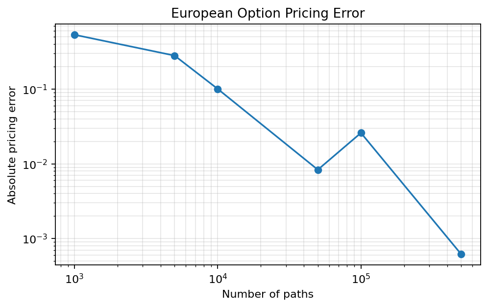
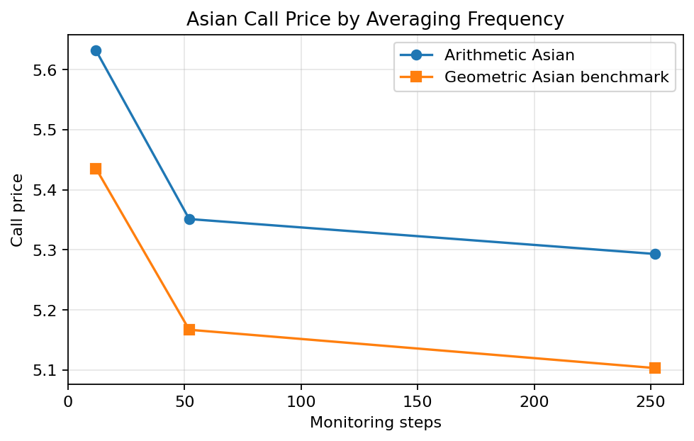
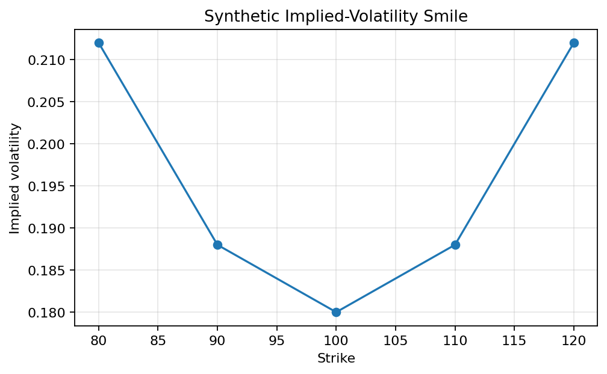
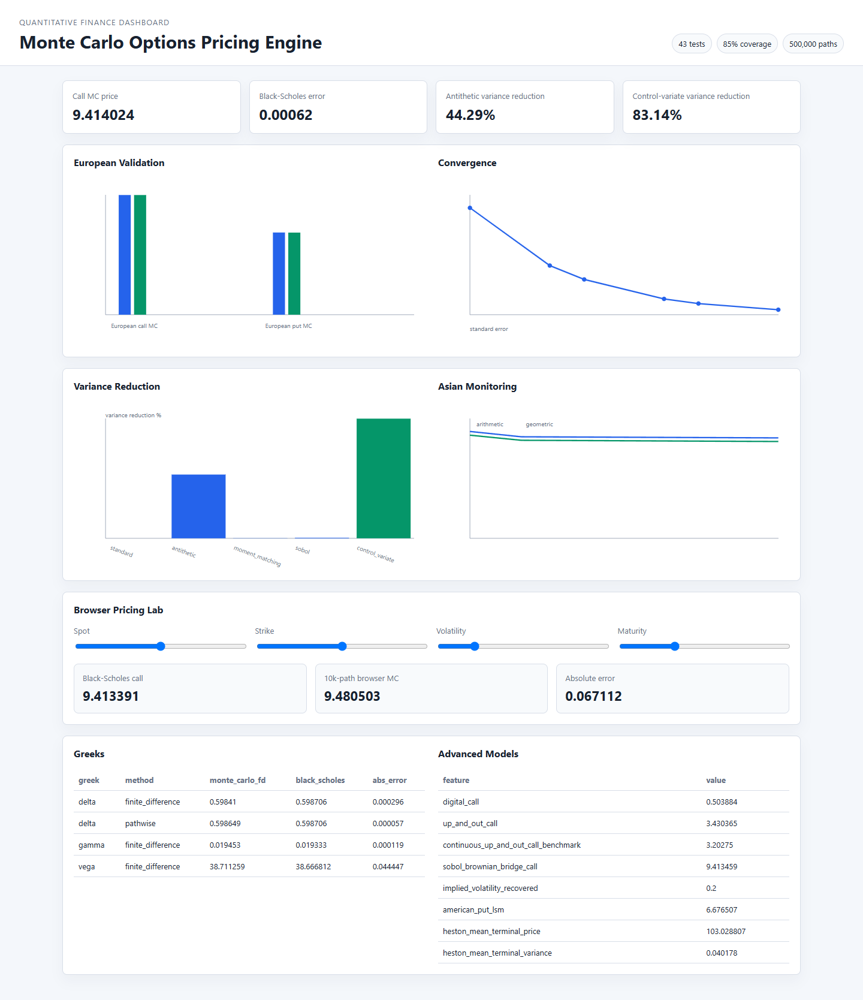

# Monte Carlo Options Pricing Engine


A polished quantitative finance project for pricing European, Asian, digital, barrier, and American-style options. The importable package is `mc_options`; it includes vectorized simulation, Black-Scholes validation, uncertainty estimates, variance reduction, analytical benchmarks, Greeks, implied volatility, Heston stochastic-volatility paths, executed notebooks, static figures, examples, a CLI, and CI-ready tooling.

## What This Demonstrates

- Monte Carlo simulation under risk-neutral dynamics.
- Statistical estimation with confidence intervals and convergence diagnostics.
- Variance reduction using antithetic, moment-matching, Sobol, Brownian bridge, and control-variate methods.
- Analytical benchmarking against Black-Scholes, geometric Asian, and continuous barrier prices.
- Numerical methods including finite differences, pathwise Greeks, implied volatility, and Longstaff-Schwartz regression.
- Professional engineering habits: package layout, tests, coverage, typing, linting, CI, docs, notebooks, examples, and reproducible scripts.

## Highlights

- Vectorized NumPy simulation for terminal prices and full GBM paths.
- European call/put pricing with Black-Scholes benchmarks and dividend yield support.
- Arithmetic-average Asian call/put pricing with a discrete geometric Asian benchmark.
- Digital and barrier option examples for discontinuous and path-dependent payoffs.
- Continuous up-and-out barrier analytical benchmark.
- Longstaff-Schwartz American put example.
- Heston stochastic-volatility path simulation.
- Synthetic implied-volatility smile calibration example.
- Monte Carlo result object with price, standard error, 95% confidence interval, runtime, sample size, payoff variance, and estimator variance.
- Variance reduction: antithetic variates, moment matching, Sobol quasi-random draws, Brownian bridge path construction, and terminal-stock control variates.
- Greeks: central finite-difference Delta/Gamma/Vega, pathwise European Delta, and bump-size sensitivity.
- CLI entry point: `mc-options`.
- GitHub Actions workflow for Python 3.11 and 3.12.
- Ruff, mypy, pytest, coverage, MkDocs, mkdocstrings, and pre-commit configuration.

## Visuals







## Setup

```bash
python -m venv .venv
source .venv/bin/activate  # Windows: .venv\Scripts\activate
python -m pip install --upgrade pip
python -m pip install -e ".[dev]"
```

The project targets Python 3.11+.

## Verify

```bash
python -m ruff check .
python -m ruff format --check .
python -m mypy src
python -m pytest
python -m mkdocs build --strict
```

Verified locally:

- `ruff`: all checks passed
- `ruff format --check`: passed
- `mypy`: no issues in `16` source files
- `pytest`: `43 passed`
- coverage: `85%`
- `mkdocs build --strict`: passed

## Run Experiments

```bash
python scripts/run_experiments.py
python scripts/generate_figures.py
python scripts/benchmark_performance.py
python scripts/generate_dashboard_data.py
```

`run_experiments.py` regenerates the key tables in `RESULTS.md`. `generate_figures.py` writes PNG charts to `figures/`. `benchmark_performance.py` writes `benchmarks/performance.csv` and `benchmarks/performance.md`. `generate_dashboard_data.py` writes `dashboard/data.json`.

## Visual Dashboard



```bash
python scripts/generate_dashboard_data.py
python scripts/serve_dashboard.py
```

Then open `http://127.0.0.1:8877`.

The dashboard visualizes European validation, convergence, variance reduction, Asian monitoring frequency, Greeks, advanced-model outputs, and a browser-side Black-Scholes versus Monte Carlo pricing lab.

## CLI Examples

```bash
mc-options price --spot 100 --strike 100 --rate 0.03 --volatility 0.20 --maturity 1.0 --paths 100000
```

Recover implied volatility:

```bash
mc-options implied-vol --spot 100 --strike 100 --rate 0.03 --maturity 1.0 --target-price 9.413403
```

Or without installing the console script:

```bash
python -m mc_options.cli price --paths 100000
```

## Python Usage

```python
from mc_options.black_scholes import black_scholes_price
from mc_options.models import MarketParameters, OptionParameters, SimulationParameters
from mc_options.pricer import price_option

market = MarketParameters(spot=100, rate=0.03, volatility=0.20, maturity=1.0)
option = OptionParameters(strike=100, option_type="call", payoff_type="european")
sim = SimulationParameters(num_paths=500_000, num_steps=1, seed=42)

mc = price_option(market, option, sim)
bs = black_scholes_price(market, option)

print(mc.price, mc.standard_error, (mc.ci_low, mc.ci_high), bs)
```

## Modeling Assumptions

The stock follows risk-neutral geometric Brownian motion:

```text
dS_t = (r - q) S_t dt + sigma S_t dW_t
```

The implementation uses the exact discrete-time update:

```text
S_{t+dt} = S_t * exp((r - q - 0.5 sigma^2) dt + sigma sqrt(dt) Z)
```

Asian options use the arithmetic average of simulated monitoring dates after time zero by default. Sobol sampling is available through `SimulationParameters(random_method="sobol")`; powers of two are preferred for balanced Sobol nets. Runtime measurements are machine-specific and should be treated as local benchmark results.

## Results Snapshot

For `S0=100`, `K=100`, `r=0.03`, `sigma=0.20`, `T=1.0`, `seed=42`, and `500,000` simulated paths:

- European call Monte Carlo price: `9.414024`
- Black-Scholes call price: `9.413403`
- Absolute pricing error: `0.000620`
- 95% confidence interval: `[9.374832, 9.453215]`
- Antithetic estimator variance reduction: `44.292597%`
- Control-variate estimator variance reduction: `83.141813%`
- Digital call example price: `0.503884`
- Up-and-out barrier call example price: `3.430365`
- Continuous up-and-out analytical benchmark: `3.202750`
- Sobol Brownian-bridge call example price: `9.413459`
- Recovered implied volatility: `0.200000`
- American put Longstaff-Schwartz estimate: `6.676507`
- Heston mean terminal price: `103.028807`
- Standard-error log-log convergence slope: `-0.493953`

See `RESULTS.md` for the full verified report.

## Reproducibility Notes

- Randomized experiments use fixed seeds.
- Notebooks are executed in CI to guard against stale examples.
- Exact local direct dependency versions are listed in `requirements-dev.lock`.
- Runtime values should be compared on the same machine and Python environment.

## Resume Bullets

- Built a vectorized Python package for European, Asian, digital, barrier, and American-style option pricing under GBM, with validated dataclass inputs, reproducible seeds, a CLI, executed notebooks, and CI-ready tests.
- Validated a `500,000`-path European call estimate against Black-Scholes with `0.000620` absolute error and empirical standard-error scaling near `1 / sqrt(N)`.
- Implemented implied volatility, Brownian bridge paths, Heston simulation, Longstaff-Schwartz American pricing, analytical barrier benchmarking, and variance-reduction methods, with a verified control-variate run reducing estimator variance by `83.141813%`.
